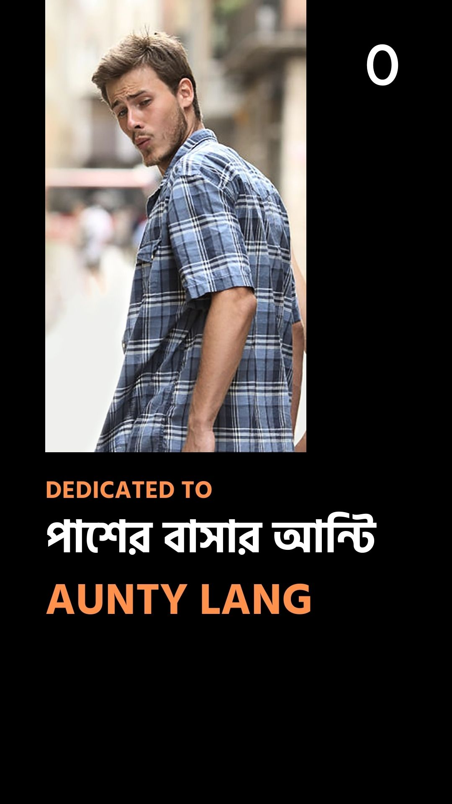
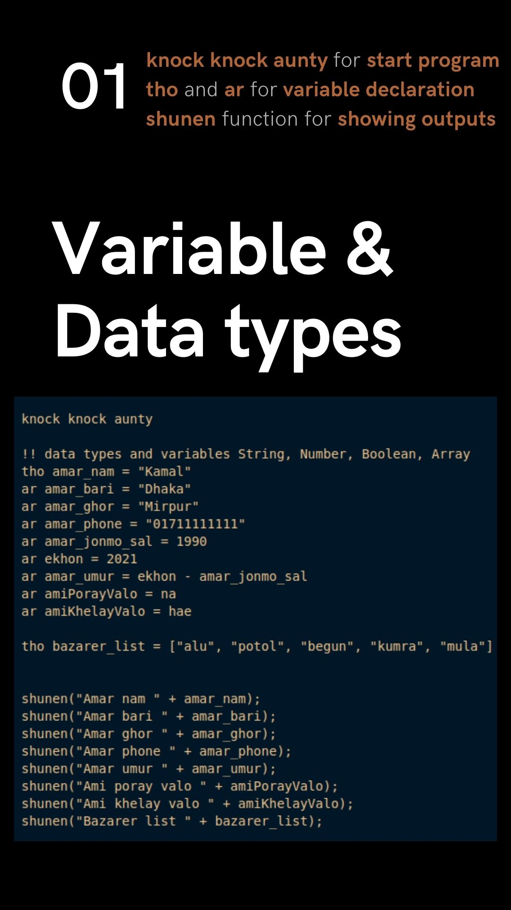
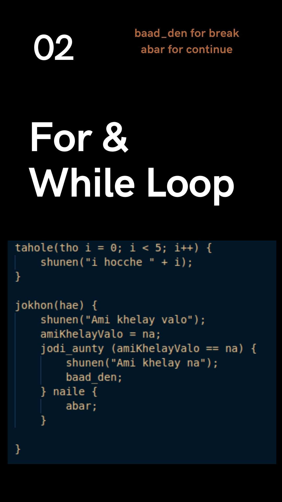
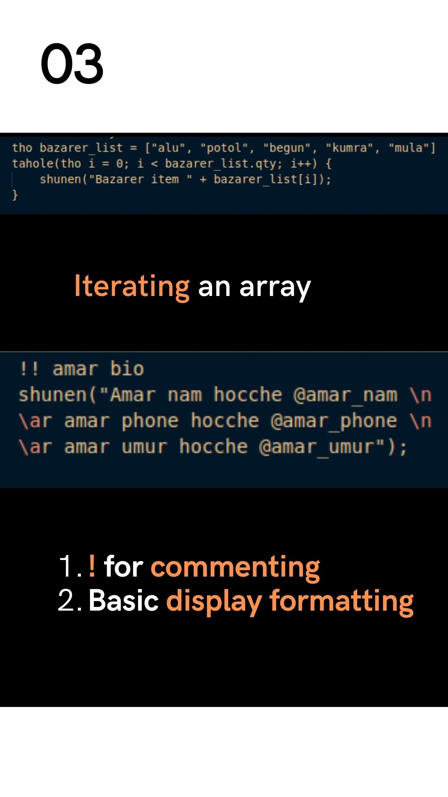
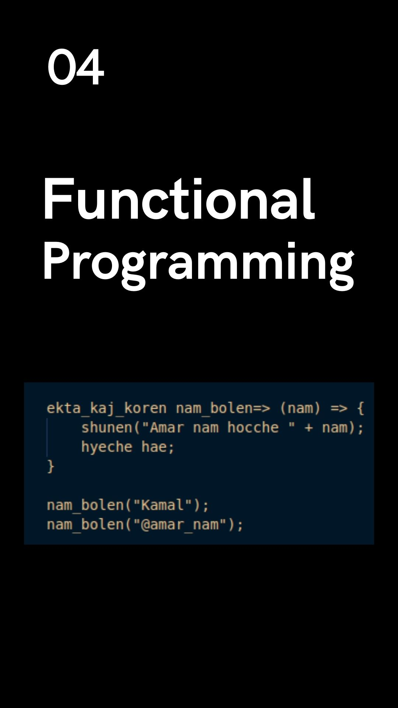
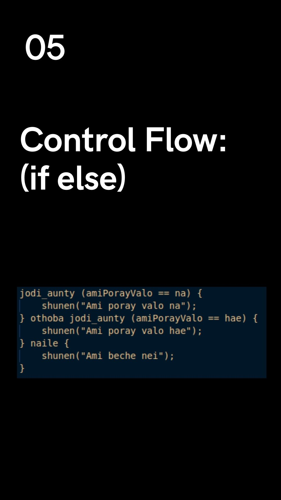
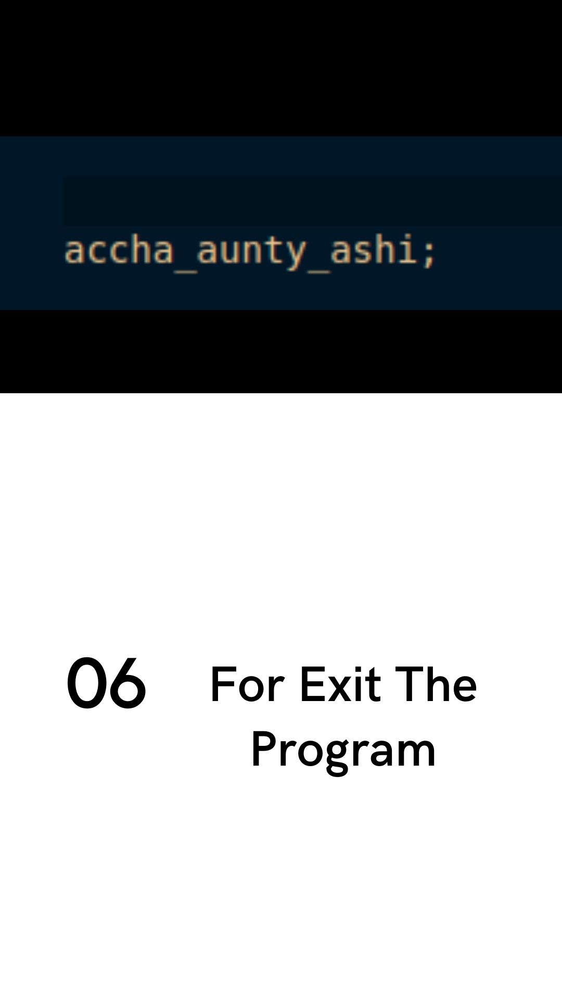

# Language Token Documentation

This document outlines the tokens recognized by the lexer in a custom programming language.

## Token Types

- **KNOCK_KNOCK**: Start of the code with "knock knock aunty".
- **COMMENT**: Ignores lines starting with "!!".
- **DISPLAY**: Calls `shunen` function with a message in double quotes.
- **FOR_LOOP**: Defines a for loop.
- **WHILE_LOOP**: Defines a while loop.
- **BREAK**: Break statement.
- **CONTINUE**: Continue statement.
- **ARRAY_DECLARATION**: Declares an array.
- **ARRAY_ITERATION**: Iterates over an array.
- **FUNCTION_DECLARATION**: Declares a function.
- **FUNCTION_CALL**: Calls a function using `shunen`.
- **IF_ELSE**: Defines an if-else block.
- **PROGRAM_END**: Marks the end of the program.
- **NUMBER**: Integer numbers.
- **BOOLEAN**: Boolean values (na or hae).
- **OPERATOR**: Arithmetic operators (+, -, *, /).
- **COMPARATOR**: Comparison operators (==, !=, <, >, <=, >=).
- **NEWLINE**: Newline characters.
- **LEFT_PAREN**: Left parenthesis "(".
- **RIGHT_PAREN**: Right parenthesis ")".
- **LEFT_BRACE**: Left brace "{".
- **RIGHT_BRACE**: Right brace "}".
- **SEMICOLON**: Semicolon ";".
- **VAR_DECLARATION**: Declares variables.
- **STRING**: String literals enclosed in double quotes.
- **VARIABLE**: Variable names.

## Example Code

```python
shunen("Amar nam " + amar_nam);
shunen("Amar bari " + amar_bari);
shunen("Amar ghor " + amar_ghor);
shunen("Amar phone " + amar_phone);
shunen("Amar umur " + amar_umur);
shunen("Ami poray valo " + amiPorayValo);
shunen("Ami khelay valo " + amiKhelayValo);
shunen("Bazarer list " + bazarer_list);
```




 
 
 
 
 
